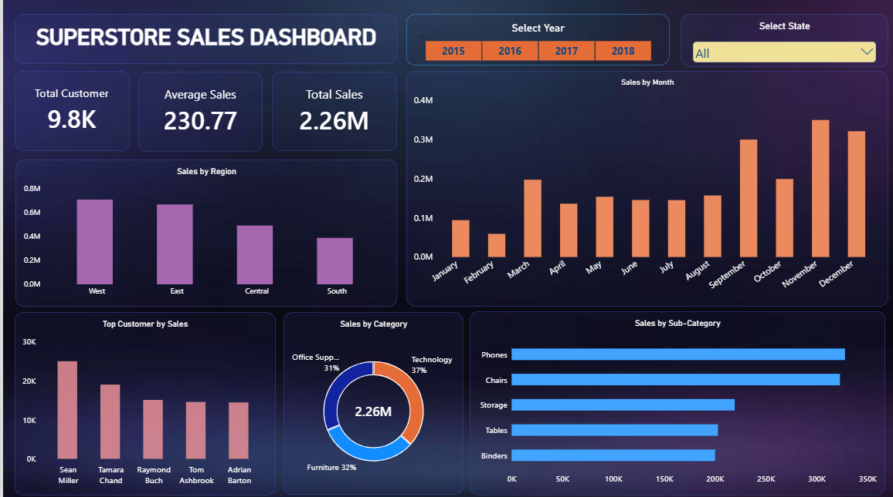

# 📊 Superstore Sales Analysis

An end-to-end data analysis project on the Superstore Sales dataset, covering data cleaning, exploratory data analysis, SQL-based business analytics, and an interactive Power BI dashboard.

## 🎯 Problem Statement

A retail superstore wants to understand its sales performance across regions, categories, and time periods to support data-driven business decisions — identifying top-performing segments, seasonal trends, and high-value customers.

## 🛠️ Tech Stack

- **Python** (Pandas, Matplotlib, Seaborn) — data cleaning and exploratory analysis
- **MySQL** (SQLAlchemy) — data storage and advanced SQL analytics
- **Microsoft Excel** — pivot table analysis
- **Power BI** — interactive dashboard and visualization

## 🔄 Approach

1. **Data Cleaning (Python)** — Handled missing values (11 missing postal codes for Burlington, VT), converted date columns to proper datetime format, and verified there were no duplicate records across ~9,800 rows.
2. **Exploratory Data Analysis (Python)** — Analyzed sales by region, category, state, and month using Pandas groupby operations, visualized with bar and pie charts.
3. **SQL Analytics (MySQL)** — Connected to MySQL via SQLAlchemy directly from the notebook and loaded the cleaned dataset into a table. Wrote and executed queries ranging from basic aggregations (GROUP BY) to advanced window functions:
   - `DENSE_RANK()` to rank customers by total purchase amount
   - `LAG()` with nested subqueries to calculate month-over-month sales growth percentage
4. **Excel Analysis** — Built pivot tables and pivot charts for Region x Category and Month x Category breakdowns.
5. **Power BI Dashboard** — Designed an interactive dashboard with KPI cards, year/state slicers, and multiple chart types for a complete business overview.

## 🔑 Key Insights

- **West region** generates the highest sales (₹7.10L), followed by East, Central, and South.
- **Technology** is the top-performing category (₹8.27L in sales), narrowly ahead of Furniture and Office Supplies.
- **California** is the top-performing state by total sales.
- **November and December** see the highest sales volume, reflecting a strong holiday/year-end seasonal pattern — sales roughly double compared to the January–August average.
- Sales show consistent month-over-month growth acceleration heading into Q4 each year, based on SQL-derived growth percentage analysis.
- The top 5 customers by total purchase account for a disproportionate share of revenue, highlighting an opportunity for targeted retention strategies.
- **Phones and Chairs** are the best-selling sub-categories overall.

## 📸 Dashboard Preview



*Interactive dashboard with year and state filters, regional and category breakdowns, monthly trends, and top-customer analysis.*

## 📁 Project Structure

```
superstore-sales-analysis/
├── README.md
├── data/
│   ├── superstore_raw_data.csv
│   └── superstore_cleaned_data.csv
├── notebooks/
│   └── 01_data_cleaning_eda_sql_analysis.ipynb   (Python cleaning, EDA, and SQL queries all in one notebook)
├── dashboard/
│   └── superstore_dashboard.pbix
└── screenshots/
    ├── excel_pivot_analysis.png
    └── powerbi_dashboard.png
```

## ▶️ How to Run

1. Clone this repository
2. Install dependencies: `pip install pandas matplotlib seaborn sqlalchemy mysql-connector-python`
3. Set up a local MySQL server and update the connection string in the notebook with your credentials
4. Run the Jupyter notebook in `notebooks/` — it covers data cleaning, EDA, loading data into MySQL, and all SQL analysis (including window functions) in one place
5. Open `dashboard/superstore_dashboard.pbix` in Power BI Desktop to explore the interactive dashboard

## 👤 Author

**Shivanshu Mishra**
[LinkedIn](https://linkedin.com/in/shivanshu-mishra-12135a341) | [GitHub](https://github.com/shivanshu-mishra01)
